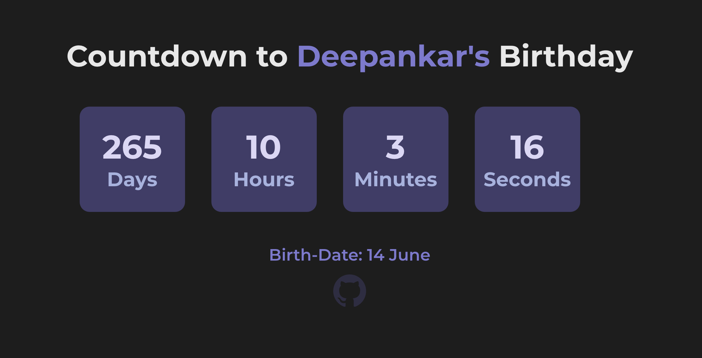

# 🎉 Birthday Wisher with Countdown! 🎂🎊

A simple and fun birthday countdown and wishing app built with **React Hooks**.

🔗 **Live Demo:** [Birthday Wisher](https://iwangsiyi.com)

## 🚀 Getting Started

To run this project locally, follow these steps:

### 1️⃣ Clone the repository

```sh
git clone https://github.com/AshinTop/Birthday-Wisher.git

cd Birthday-Wisher
```

### 2️⃣ Install dependencies

```sh
npm install
```

### 3️⃣ Start the development server

```sh
npm start
```

### 4️⃣ Build the project

```sh
npm run build
```

## ✨ Updates & Features

- **🎨 Updated UI**: Changed the background color of the **"Generate Page → Select Options"** section.
- **🛠 Bug Fix**: Resolved the issue where the **wish page** was not displaying on birthdays.
- **🎆 New Feature**: Added a brand-new **Birthday Wish Page** with an animated **birthday cake fireworks** effect!

## 🎈 How to Use

1️⃣ Visit 👉 Visit [Birthday Wisher](https://iwangsiyi.com)

2️⃣ Click "Generate Link" or go directly to 👉 [Generate Page](https://iwangsiyi.com/generate)

3️⃣ Enter the Name, Day, and Month of the birthday 🎂


4️⃣ Click "**Generate Link**"

5️⃣ Copy the generated link or click the button to visit it

6️⃣ On the birthday, the countdown disappears, and a beautiful **birthday wish page** appears! 🎊


## Countdown Timer Preview

Here's a preview of the countdown feature:



## 🎂 Birthday Wisher in Action

When the countdown reaches zero, the birthday wish page loads automatically!


## 🎆 New Animated Birthday Wish Page!


## 🎨 Customization & Styling

- The app is fully responsive 📱💻

- Modify styles in app.css

- Main components:
  - Wishing Component: Wish.jsx
  - Countdown Timer Component: Countdown.jsx

---

Enjoy and make birthdays extra special! 🎉🎂🥳
Give a ⭐ if you like this project! 😊
